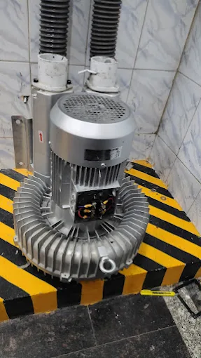

<!DOCTYPE html>
<html lang="en">
<head>
    <meta charset="UTF-8">
    <meta name="viewport" content="width=device-width, initial-scale=1.0">
    <title>Excel Electricals | Motor Winding & Repair Workshop</title>
    
    <!-- Google Fonts -->
    <link rel="preconnect" href="https://fonts.googleapis.com">
    <link rel="preconnect" href="https://fonts.gstatic.com" crossorigin>
    <link href="https://fonts.googleapis.com/css2?family=Plus+Jakarta+Sans:wght@400;500;600;700;800&family=Space+Grotesk:wght@600;700;800&display=swap" rel="stylesheet">
    
    <!-- FontAwesome Icons -->
    <link rel="stylesheet" href="https://cdnjs.cloudflare.com/ajax/libs/font-awesome/6.4.0/css/all.min.css">

    <!-- Analytics Tag -->
    
    

    
</head>
<body>

    

    

    <!-- HEADER NAVIGATION -->
    <header>
        <a href="#home" class="brand-logo">
            
<i class="fa-solid fa-bolt"></i>

            EXCEL ELECTRICALS
        </a>
        <nav>
            <a href="#home">Home</a>
            <a href="#gallery">Gallery</a>
            <a href="#services">Services</a>
            <a href="#about">About</a>
            <a href="#contacts">Contacts</a>
            <a href="#request" class="nav-btn">Service Request</a>
        </nav>
    </header>

    <!-- HOME HERO SECTION -->
    <section class="hero" id="home">
        

            

                <i class="fa-solid fa-shield-halved"></i> Certified Workshop • Choondy, Aluva
            

            <h1>EXPERT ELECTRIC MOTOR WINDING & REPAIR</h1>
            
Reliable stator rewinding, coil replacement, dynamic rotor testing, and complete motor repairs with guaranteed copper quality.

            

                <a href="tel:+919876543210" class="btn btn-primary"><i class="fa-solid fa-phone"></i> Call Workshop</a>
                <a href="https://wa.me/919876543210" class="btn btn-outline"><i class="fa-brands fa-whatsapp" style="color: #22c55e;"></i> WhatsApp Chat</a>
            

        

        

            
        

    </section>

    <!-- GALLERY SECTION -->
    <section id="gallery">
        

            <small>Workmanship</small>
            <h2>Motor Repair Gallery</h2>
        

        

            

                
                

                    <h3>Induction Motor Repair</h3>
                    
Heavy duty single & 3-phase induction motor diagnostic and overhaul.

                

            

            

                
                

                    <h3>Mechanical Overhaul</h3>
                    
Bearing replacement, shaft polish, and dynamic housing alignment.

                

            

            

                
                

                    <h3>Stator Copper Winding</h3>
                    
High-grade dual coated copper wire coil insertion & varnish dipping.

                

            

            

                
                

                    <h3>Component Servicing</h3>
                    
Capacitors, cooling fan blades, terminal boards, and relay repairs.

                

            

        

    </section>

    <!-- SERVICES SECTION -->
    <section id="services" style="background: rgba(255,255,255,0.6);">
        

            <small>High Quality</small>
            <h2>Our Workshop Services</h2>
        

        

            

                
<i class="fa-solid fa-bolt"></i>

                <h3>Copper Rewinding</h3>
                
Complete stator & coil rewinding using premium copper wire and thermal insulation paper.

            

            

                
<i class="fa-solid fa-screwdriver-wrench"></i>

                <h3>Electrical Testing</h3>
                
Megger insulation test, fault troubleshooting, and coil balancing checks.

            

            

                
<i class="fa-solid fa-gear"></i>

                <h3>Bearing Fitting</h3>
                
Precision removal and installation of high-speed SKF/NBC motor bearings.

            

            

                
<i class="fa-solid fa-car-battery"></i>

                <h3>Capacitor & Relays</h3>
                
Testing and replacement of start/run capacitors and centrifugal switches.

            

        

    </section>

    <!-- ABOUT SECTION -->
    <section id="about">
        

            <small>Who We Are</small>
            <h2>About Excel Electricals</h2>
        

        

            

                <h3 style="font-size: 1.6rem; margin-bottom: 15px;">Dedicated Motor Winding Specialist</h3>
                
Excel Electricals provides fast, trusted, and durable motor winding solutions for industrial machines, domestic pumps, and commercial equipment in Choondy, Aluva.

                <ul class="about-features">
                    <li><i class="fa-solid fa-circle-check"></i> 100% Super Enameled Copper Wire</li>
                    <li><i class="fa-solid fa-circle-check"></i> Fast Turnaround & Emergency Support</li>
                    <li><i class="fa-solid fa-circle-check"></i> Certified & Tested Before Delivery</li>
                </ul>
            

            

                
            

        

    </section>

    <!-- CONTACTS SECTION -->
    <section id="contacts" style="background: rgba(255,255,255,0.6);">
        

            <small>Reach Us</small>
            <h2>Contact & Location</h2>
        

        

            

                

                    
<i class="fa-solid fa-location-dot"></i>

                    

                        <h4 style="margin-bottom: 4px;">Workshop Location</h4>
                        
Choondy, Edathala, Aluva, Ernakulam, Kerala

                    

                

                

                    
<i class="fa-solid fa-phone"></i>

                    

                        <h4 style="margin-bottom: 4px;">Phone Call</h4>
                        
+91 98765 43210

                    

                

                

                    
<i class="fa-solid fa-id-card"></i>

                    

                        <h4 style="margin-bottom: 4px;">GST Registration</h4>
                        
GSTIN: 32AAGPX3837Q1ZZ

                    

                

            

            

                <iframe src="https://maps.google.com/maps?q=Excel%20Electricals,%20Choondy,%20Aluva&t=&z=15&ie=UTF8&iwloc=&output=embed" width="100%" height="100%" style="border:0;" allowfullscreen="" loading="lazy"></iframe>
            

        

    </section>

    <!-- SERVICE REQUEST FORM SECTION -->
    <section id="request">
        

            <small>Online Booking</small>
            <h2>Submit a Service Request</h2>
        

        

            

                <form id="directMsgForm">
                    <input type="hidden" name="access_key" value="YOUR_WEB3FORMS_ACCESS_KEY">
                    

                        <label>Your Name</label>
                        <input type="text" name="name" class="form-control" placeholder="Enter full name" required>
                    

                    

                        <label>Phone Number</label>
                        <input type="tel" name="phone" class="form-control" placeholder="Enter 10-digit mobile number" required>
                    

                    

                        <label>Motor Issue / Equipment Details</label>
                        <textarea name="message" rows="4" class="form-control" placeholder="Describe HP, motor brand, or motor fault..." required></textarea>
                    

                    <button type="submit" id="submitBtn" class="btn btn-primary" style="width: 100%; justify-content: center;">
                        <i class="fa-solid fa-paper-plane"></i> Send Request
                    </button>
                    

                </form>
            

        

    </section>

    <!-- FLOATING QUICK BAR -->
    

        <a href="tel:+919876543210" class="float-link float-gold"><i class="fa-solid fa-phone"></i> Call Workshop</a>
        |
        <a href="https://wa.me/919876543210" class="float-link"><i class="fa-brands fa-whatsapp" style="color: #22c55e;"></i> WhatsApp</a>
    

    <!-- FOOTER -->
    <footer>
        

            4.9 Rating
            ★★★★★
            Google Verified
        

        
&copy; 2026 EXCEL ELECTRICALS | Choondy, Aluva, Ernakulam, Kerala | GSTIN: 32AAGPX3837Q1ZZ

    </footer>

    <!-- Form Script -->
    
</body>
</html>
